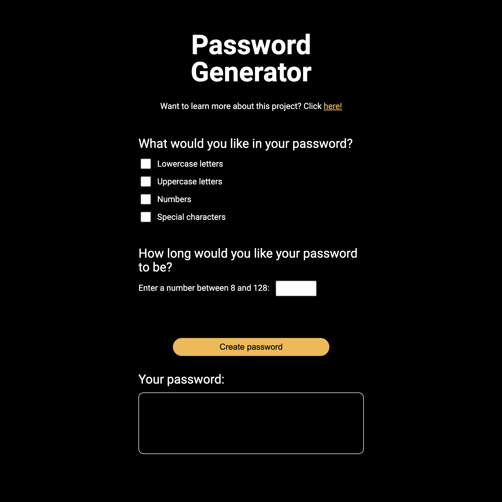
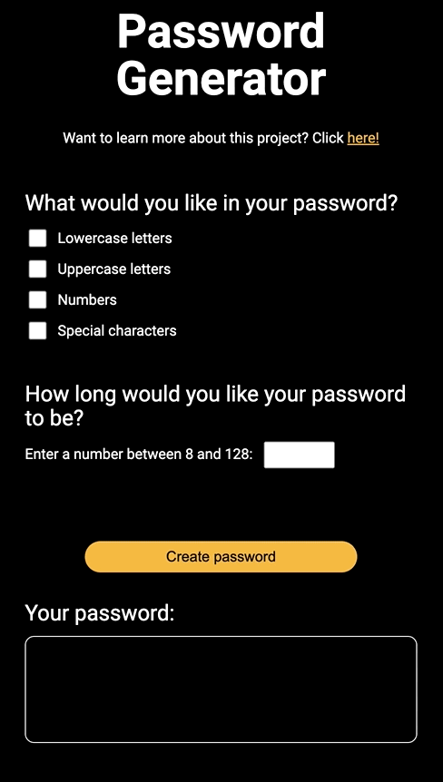
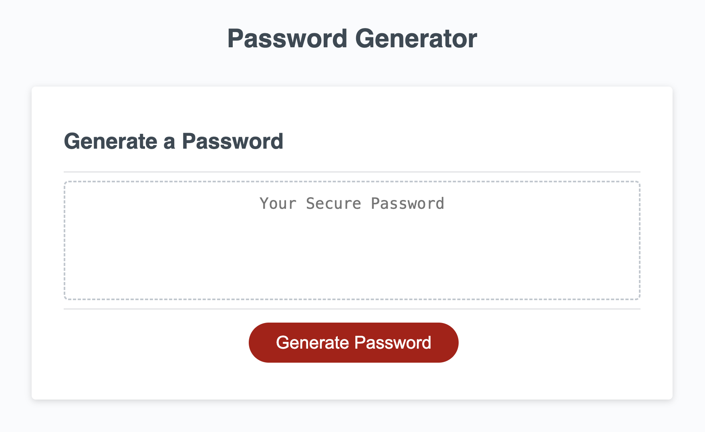

 

# Password Generator
This application generates a password between 8 and 128 characters in length, based on the type of characters a user would like in their password.  This application was redesigned from a bootcamp assignment I did.

## How to use this application
Click [here](https://guillermo-martin.github.io/passwordGenerator2/) to open up the Password Generator.

1. Select at least one of the password options:  lowercase letters, uppercase letters, numbers, or special characters.
2. Indicate the length of your password (between 8 and 128 characters).
3. Click on the "Create password" button and your password will appear in the box.

 

## About this project
 
In this project, I wanted to revisit a project from my coding bootcamp and challenge myself by redesigning the application.  To see the application before I redesigned it, click [here](https://guillermo-martin.github.io/passwordGenerator/).  

In the original project, the design was already complete, as the assignment mainly focused on building out the functionality.  In this redesign, I wanted to address the functionality in order to improve the user experience.  One thing I wanted to address was the inability for a user to go backwards when asked what options they wanted in their password.  I also wanted to address the lack of a copy feature in the application.  Finally, I wanted to redesign the UI to incoporate the new functionality.

## Want to learn more?
Want to learn about how I redesigned this application?  Read more [here](https://guillermo-martin.github.io/web-developer-projects/password-generator/)!
