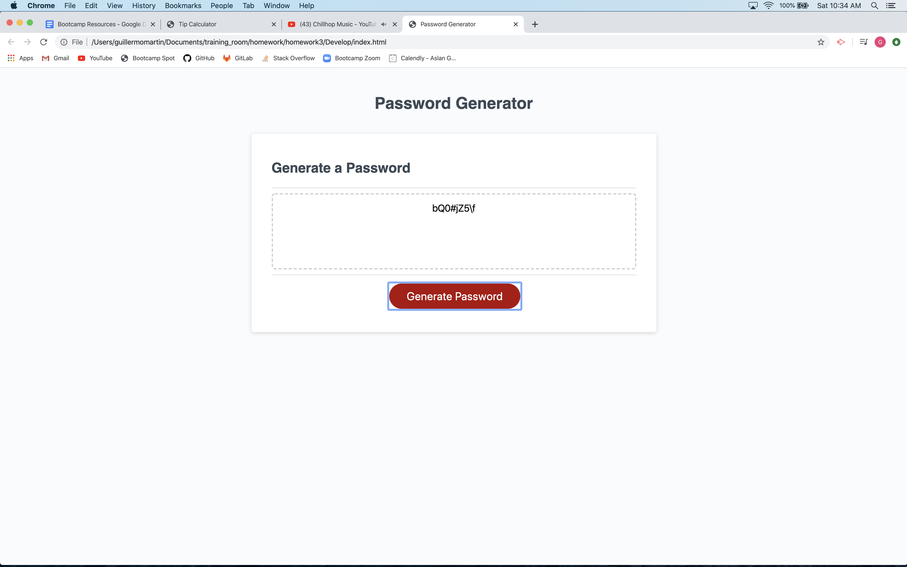

 

# Password Generator
This application generates a password between 8 and 128 characters in length, based on the type of characters a user would like in their password.

## How to use this application
Click [here](https://guillermo-martin.github.io/passwordGenerator2/) to open up the Password Generator.

1. Select at least one of the password options:  lowercase letters, uppercase letters, numbers, or special characters.
2. Indicate the length of your password (between 8 and 128 characters).
3. Click on the "Create password" button and your password will appear in the box.

 

## About this project
In this project, I wanted to revisit a project from my coding bootcamp and challenge myself by redesigning the application.  To see the application before I redesigned it, click [here](https://guillermo-martin.github.io/passwordGenerator/).  In the original project, the design was already complete, as the assignment mainly focused on building out the functionality.  In addition to the design, I wanted to address the functionality itself in order to improve the user experience.  One thing I wanted to address was the inability for a user to go backwards when asked what options they wanted in their password.  I also wanted to address the lack of a copy feature in the application.

## Technologies used
HTML, CSS, and JavaScript.

## Want to learn more?
Want to learn about how I redesigned this application?  Click [here](https://guillermo-martin.github.io/passwordGenerator2)!

<!-- https://guillermo-martin.github.io/passwordGenerator/

## Description

The app generates a password between 8 and 128 characters. When a user presses the "Generate Password" button, a series of prompts will be given to the user. These prompts ask how long the user would like their password and if they want lowercase letters, uppercase letters, numbers, or special characters in their password. Using these prompts, a password will be generated that meets the user's desired length and desired criteria. The app will then display an alert with a randomly generated password meeting the user's desired criteria. The password will also be printed out onto the text area.

## Technologies
* Languages, frameworks, various tools
    * HTML, CSS, and JavaScript

## Challenges
* Your experience building this app
    * I had ups and downs building the app.  There were times when I was proud of myself for coming up with certain aspects of the code on my own, such as creating the functions and determining some of the logic.  There were also some frustrating times when I felt like I had an idea and when I tried to execute it, it wouldn't work.
* What was difficult
    * One of the difficult parts of this homework, I thought, was trying to loop through all of the character generator functions a certain number of times.  Depending on the user's desired password length, the loop would repeat that many times, but then would provide a password that didn't meet the user's desired length.
* What did you learn
    * I learned about "NaN", using while loops, and to focus on one issue at a time.
    * I also learned to break problems down into smaller problems and tackle those smaller problems first. 
    * I also learned that using alerts was a good way of troubleshooting my code.
* How did you go about solving a problem
    * To solve a problem, I would write down what the problem was, and ask myself questions on how to accomplish it.  I would then write down each idea and then tackle each idea one at a time.
    * I also used the console and alerts to help me see any issues I was having.
    * I also would Google things and attend office hours.

## Screenshot
 -->
